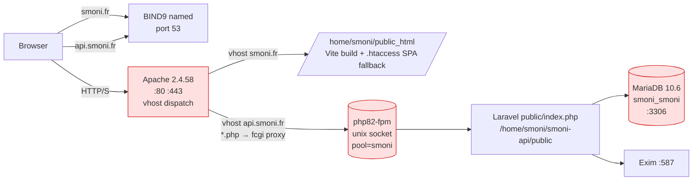
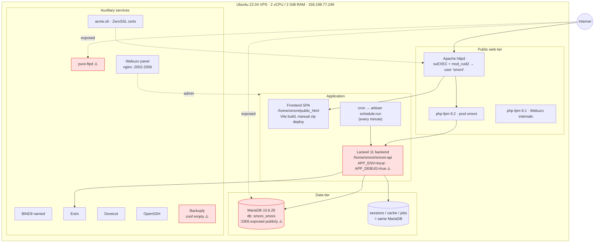

# Smoni production architecture — read-only audit

_Generated 2026-05-22. Source: live inspection of `root@159.198.77.249` via SSH. Nothing was modified._

## 1. Host

| Item | Value |
|---|---|
| Provider | Single bare VPS (no LB, no autoscale, no cluster) |
| Public IP | `159.198.77.249` |
| OS | Ubuntu 22.04.5 LTS (Jammy), kernel 5.15.0-179 |
| CPU / RAM / Disk | 2 vCPU / 1.9 GiB RAM (no swap) / 40 GiB ext4 (16 GiB used) |
| Hostname | `server1.smoni.fr` |
| Uptime | ~14 h (recent reboot) |

Everything below runs on this one box. Single point of failure.

## 2. Control plane

The box is administered by **Webuzo** (Softaculous's shared-hosting panel). That decision shapes everything else: Webuzo installs Apache+PHP-FPM under `/usr/local/apps/`, generates the vhost files, manages users (`smoni` is a Webuzo user), runs its own internal nginx on ports 2002–2006 for the panel UI, and bundles **Backuply** for backups.

`webuzo.service` runs as a systemd unit.

## 3. Public-facing services (the request path)

| Port | Process | Role |
|---|---|---|
| 80 / 443 | **Apache 2.4.58** (`/usr/sbin/httpd`, master as root, workers as `nobody`) | Public HTTP/S |
| 25, 465, 587 | **Exim 4** | SMTP |
| 110, 143, 993, 995 | **Dovecot** | IMAP / POP3 |
| 53 (TCP/UDP) | **BIND9** (`named`) | Authoritative DNS for smoni.fr |
| 21 | **pure-ftpd** | FTP (still exposed) |
| 22 | **OpenSSH** | Admin |
| 3306 | **MariaDB 10.6.26** | DB (listening on `0.0.0.0` — exposed publicly) |
| 2002–2006 | nginx (Webuzo internal) | Panel + webmail proxy |

**Firewall**: UFW inactive; iptables INPUT policy is ACCEPT with only a handful of manual `-s …/ACCEPT` rules from bash history. Effectively no firewall — MariaDB and FTP are reachable from the internet.

## 4. Apache → app wiring

Two HTTPS vhosts, both defined in `/usr/local/apps/apache2/etc/conf.d/webuzoVH.conf`:

- **`smoni.fr`** (+ `www`, `mail` aliases) → `DocumentRoot /home/smoni/public_html` (the React/Vite SPA build).
- **`api.smoni.fr`** (+ `www`, `mail` aliases) → `DocumentRoot /home/smoni/smoni-api/public` (Laravel `public/index.php`).

Key Apache features in use:
- **suEXEC + mod_ruid2**: per-request drop to user `smoni:smoni` instead of `nobody`.
- **mod_rewrite SPA fallback** via `.htaccess` for the frontend (`RewriteRule ^ index.html [L]`).
- **PHP via FPM Unix socket**: `proxy:unix:/usr/local/apps/php82/var/fpm-smoni.sock|fcgi://localhost` — Apache forwards `*.php` to a PHP 8.2 FPM pool.
- **Force-HTTPS**: port 80 vhosts `Redirect permanent` to the HTTPS variant (with an ACME `.well-known/` exclusion).
- **mod_security2 disabled** (`SecRuleEngine Off`) on both vhosts.

## 5. PHP stack

- System PHP CLI: 8.1.2 (`/usr/bin/php`) — what cron uses.
- Apache-fronted PHP-FPM: 8.2 (`/usr/local/apps/php82/`) — what serves HTTP.
- 8.3 also installed but unused.

`php-fpm` masters run for each version (`php81`, `php82`); only the `smoni` pool on 8.2 is wired into the vhosts. Config in `/usr/local/apps/php82/etc/php-fpm.conf` is the stock Webuzo template.

⚠️ **Cron uses PHP 8.1, web uses PHP 8.2** — small mismatch risk for extension/feature parity.

## 6. Laravel API (`/home/smoni/smoni-api`)

- Framework boots from `/home/smoni/smoni-api/public/index.php`.
- **No `.git`** in the directory. Deployment is manual — see §9.
- `.env` highlights:
  - `APP_ENV=local`, `APP_DEBUG=true` on production. ⚠️ Leaks stack traces and uses dev-tuned defaults.
  - `APP_URL=https://api.smoni.fr`
  - DB: `localhost` MariaDB, db `smoni_smoni`, user `smoni_root`
  - `SESSION_DRIVER=database`, `CACHE_STORE=database`, `QUEUE_CONNECTION=database` → everything hits MariaDB (`sessions`, `cache`, `jobs` tables).
  - `MAIL_MAILER=smtp` → `smoni.fr:587` (local Exim).
  - `STRIPE_KEY=pk_live_…`, `STRIPE_SECRET=rk_live_…` (production).
- Routes: `routes/api.php`, `routes/web.php`, `routes/console.php`.
- Stale dump artifacts in the app dir: `smoni api.zip`, `smoniBack.zip`, `smoni_v1.zip`, `smoni_v2.zip`, `smoni_api.zip` (Aug 2025 → Mar 2026).
- Logs: `storage/logs/laravel.log` (~240 KiB, single file rotation).

### Scheduled / async work
- `smoni`'s crontab: `* * * * * /usr/bin/php /home/smoni/smoni-api/artisan schedule:run >> /dev/null 2>&1` — once per minute.
- `QUEUE_CONNECTION=database` but **no queue worker process is running** (no supervisor, no systemd unit, no horizon). Jobs are only processed if `schedule:run` triggers `queue:work --once` from `console.php` (need to confirm by reading that file — flag for later).

## 7. Frontend SPA (`/home/smoni/public_html`)

- Output of a Vite build (filenames like `1-V-wEo5FJ.png`, hashed asset names; 150 entries in `assets/`).
- `index.html` injects React app + Stripe & Sketchfab CDN scripts.
- `.htaccess` does standard SPA fallback to `index.html`.
- **Multiple historical zip artifacts sitting next to the live files**: `frontend.zip`, `frontend update.zip`, `frontendd.zip`, `frontendUpdate.zip`, `frontendUpdatee.zip` (~25 MB each, Apr 2026). These are *served publicly* under `https://smoni.fr/frontend.zip` etc. — full source archives exposed.

## 8. TLS

- ACME client: `acme.sh` in `/home/smoni/.acme.sh/`.
- CA: **ZeroSSL** (RSA DV SSL CA 2), not Let's Encrypt.
- Cert files under `/var/webuzo/users/smoni/ssl/*-combined.pem`.
- Current `api.smoni.fr` cert: valid 2026-05-22 → 2026-08-20 (90-day cycle). acme.sh handles renewals via its own cron.

## 9. "Deployment pipeline"

There is **no CI/CD**. No `.git` on the server, no webhook, no rsync deploy script, no `composer install --no-dev` hook, no `npm run build` automation. Evidence:

- Multiple progressively-named zip artifacts (`frontend.zip` → `frontend update.zip` → `frontendd.zip` → `frontendUpdate.zip` → `frontendUpdatee.zip`) suggesting iterative manual uploads.
- Root bash history shows manual `tar -czf site.tar.gz public_html/` (backup-by-hand).
- Webuzo's File Manager / FTP (pure-ftpd is up) is the most likely upload channel.

**Effective deploy procedure (reconstructed):**
1. Build SPA locally (`pnpm build`).
2. Zip the `dist/` output.
3. Upload via FTP or Webuzo File Manager into `/home/smoni/public_html`.
4. Unzip in place; old zip is left as a sibling.
5. For backend: upload a `smoni*.zip` into `/home/smoni/smoni-api/`, unzip, the zip is left in the deployed tree (which is why old versions are still there).
6. Run `php artisan migrate` manually if schema changed (no automation found).

⚠️ This is the single biggest operational risk: rollback is informal, "live = whatever files are currently in the doc root", and there's no atomic switch (no symlinked `current/` release dir).

## 10. Backups

- **Backuply** (Softaculous's backup product) is installed at `/usr/local/backuply/` and `/var/backuply/`.
- `/var/backuply/conf/` exists but the `*.conf` files are empty — backup not configured to run.
- `/var/backups/` contains only OS-level dpkg/alternatives rotations, not app/DB backups.
- ⚠️ **No evidence of an active automated backup of the DB or app data.**

## 11. Observed running tree

```
Apache (httpd) [root master + nobody workers]
 └── per-request RUID2 → smoni:smoni
      └── PHP via unix socket → php82-fpm pool "smoni"

php-fpm 8.1 master  (Webuzo internal pages, panel)
php-fpm 8.2 master  (smoni app)
nginx (Webuzo)       ports 2002-2006 → panel/webmail proxy
mariadbd             port 3306, db smoni_smoni
named                ports 53 (authoritative DNS)
exim                 ports 25/465/587
dovecot              ports 110/143/993/995
pure-ftpd            port 21
sshd                 port 22
cron                 → smoni's "schedule:run" every minute
webuzo.service       panel daemon
```

---

## 12. Architecture diagrams

### Request flow



### Process / service topology (single host)



### "Deployment pipeline" (such as it is)

```mermaid
flowchart LR
    Dev[Developer laptop]
    Build1[pnpm build → dist/]
    Build2[Zip backend source]
    FTP[FTP / Webuzo File Manager]
    Live1[/home/smoni/public_html]
    Live2[/home/smoni/smoni-api]
    Mig[manual: php artisan migrate]
    Old[Old zip artifacts left behind ⚠️]

    Dev --> Build1 --> FTP
    Dev --> Build2 --> FTP
    FTP --> Live1
    FTP --> Live2
    Live2 --> Mig
    Live1 -.-> Old
    Live2 -.-> Old
```

---

## 13. Risk summary (read-only observations, not fixed)

| # | Finding | Why it matters |
|---|---|---|
| 1 | `APP_ENV=local` + `APP_DEBUG=true` on production | Leaks stack traces, env, secrets via error pages; disables prod optimizations |
| 2 | Live Stripe keys in `.env` on a debug-mode app | Combined with #1, exploitable |
| 3 | MariaDB bound to `0.0.0.0:3306`, no firewall | Public DB exposure |
| 4 | UFW inactive, iptables ACCEPT-default | No network-level isolation |
| 5 | pure-ftpd exposed on :21 | Plaintext FTP for deploy uploads |
| 6 | No `.git`, no CI/CD — manual zip uploads | No reproducibility, no rollback, no audit trail of releases |
| 7 | Backend source `.zip` files left inside `/home/smoni/smoni-api/`, frontend `.zip` files left in `public_html/` | Source code publicly downloadable (`https://smoni.fr/frontend.zip` etc.) |
| 8 | Backuply installed but unconfigured | No automated DB/app backups |
| 9 | Queue driver = database with no worker process running | Async jobs may never execute (only via scheduled `queue:work` if defined in `console.php`) |
| 10 | sessions + cache + queue all in the same MariaDB | Single resource is the failure / hot-spot point |
| 11 | Single VPS, 2 GB RAM, no swap | No headroom; one OOM kills the site |
| 12 | Cron uses PHP 8.1, web uses PHP 8.2 | Subtle parity risks for jobs |
| 13 | ZeroSSL 90-day certs via acme.sh — automated, but no monitoring | Silent renewal failure would only show up at expiry |

Nothing was changed. All findings are from read-only inspection of configs and process listings.
